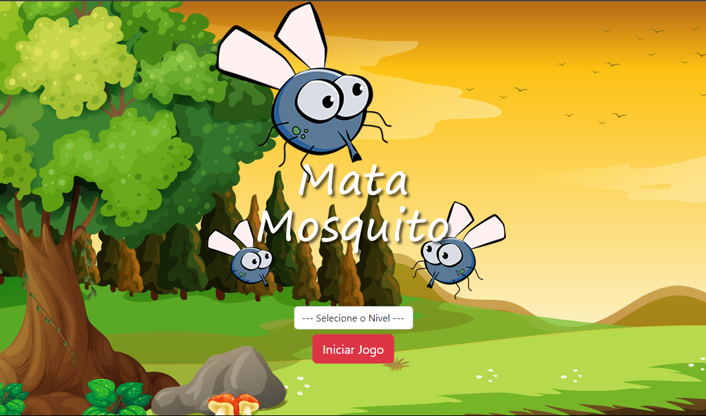

     <h1>Jogo Mosca</h1>

## Data

    27/04/2024 , Fortaleza - CE

## Descrição

   Jogo Mosca é um jogo que foi criado utilizando JavaScript, HTML/CSS e Bootstrap. Como o jogo funciona: você tem que matar as moscas antes do tempo acabar. Se você não conseguir, é game over. Quem ganha é quem matar as moscas antes do tempo acabar.

## Funcionalidade
- Jogo de Diversão

## Imagens do Projeto

## Autor
@KaueNunez

## Agradecimentos
- Jorge Sant Ana
- Curso : Desenvolvimento Web Completo - 20 cursos + 20 projetos
  

    <h1>KaueNunez - 👨🏻‍💻 + ☕ = < / ></h1>

